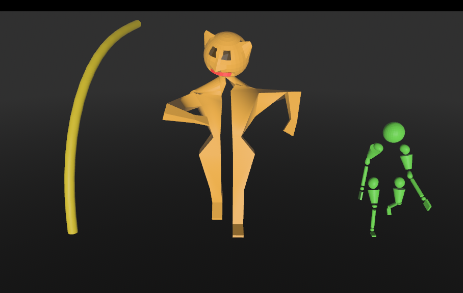

# Bevy Gltf Animator Helper
Made as attempt to simplify process of animation of gltf models. 

## Examples
I drew and animated the models myself. That's why they are so scary. I have no doubt that you will find better ones for yourself. :)



```sh
cargo r --example basic
```

## Usage
Add to your dependencies

```toml
[dependencies]
bevy_gltf_animator_helper = {git = "https://github.com/xenon615/bevy_gltf_animator_helper"}
```  
Check out  [/examples/basic.rs](/examples/basic.rs) for further information

## Version Compatibility
| bevy | bevy_gltf_animator_helper |
| ---- | ------------------------- |
| 0.18 | 0.4                       |
| 0.17 | 0.3                       |
| 0.16 | 0.2                       |
| 0.15 | 0.1                       |


